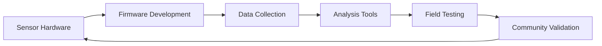

<div align="center">

# 🔬 ParaSense Labs

### *Advancing Paranormal Research Through Open Science*

[](https://parasenselabs.se)
[](#)
[](#)

**Building the future of evidence-based paranormal investigation**

[About](#about) • [Projects](#projects) • [Technology](#technology) • [Get Involved](#get-involved) • [Contact](#contact)

</div>

---

## 🎯 About

ParaSense Labs is an open-source initiative dedicated to bringing **scientific rigor** to paranormal research. We design, build, and share tools that enable anyone to conduct evidence-based investigations of unexplained phenomena.

### Our Mission

To democratize paranormal research by providing:
- 🔓 **Open hardware designs** - Accessible to makers and researchers worldwide
- 📊 **Transparent methodology** - Reproducible experiments and clear documentation
- 🧪 **Scientific approach** - Statistical validation, baseline correction, and controlled testing
- 🌍 **Community-driven development** - Collaborative improvement through peer review

### Core Values
```
🔬 Scientific Integrity  →  Evidence over belief
🤝 Open Collaboration   →  Shared knowledge benefits everyone
🎓 Education           →  Teaching scientific methodology
💡 Innovation          →  Pushing technological boundaries
```

---

## 🚀 Projects

### Active Development

| Project | Description | Status |
|---------|-------------|--------|
| **[PSL-Sensor-Core](https://github.com/ParaSense-Labs/PSL-Sensor-Core)** | ESP32-based sensor firmware for multi-parameter detection | 🟡 Alpha |
| **[PSL-Hardware](https://github.com/ParaSense-Labs/PSL-Hardware)** | Open hardware designs, schematics, and PCB layouts | 🟡 Alpha |
| **[PSL-Data-Analysis](https://github.com/ParaSense-Labs/PSL-Data-Analysis)** | Statistical analysis tools and visualization suite | 🔴 Planning |
| **[PSL-Docs](https://github.com/ParaSense-Labs/PSL-Docs)** | Research protocols, methodology, and guides | 🟢 Active |

### Coming Soon

- 📱 Mobile companion app for real-time monitoring
- 🌐 Web dashboard for data visualization
- 📡 Multi-sensor network synchronization
- 🗺️ Location-based data mapping

---

## 🛠️ Technology Stack

Our tools are built on proven, accessible technology:

### Hardware
- **Microcontroller:** ESP32 (WiFi + Bluetooth LE)
- **Sensors:** Magnetometers, EMF detectors, environmental sensors
- **Power:** Battery + solar capable designs
- **Connectivity:** BLE mesh networking, WiFi, GPS

### Software
- **Firmware:** C++ / Arduino framework / ESP-IDF
- **Data Analysis:** Python (NumPy, SciPy, Pandas)
- **Visualization:** Matplotlib, Plotly, Grafana
- **Version Control:** Git, GitHub Actions for CI/CD

### Methodology
```
1. Baseline Measurement → Establish normal conditions
2. Controlled Testing   → Eliminate environmental factors
3. Data Collection      → Multi-parameter logging
4. Statistical Analysis → Identify anomalies scientifically
5. Peer Review         → Community validation
```

---

## 🧪 Scientific Approach

### How We Maintain Rigor

✅ **Control for false positives**
- Background EMF mapping
- Temperature/humidity correlation
- Mechanical vibration detection
- Power supply noise filtering

✅ **Reproducible results**
- Timestamped raw data
- GPS location tagging
- Environmental condition logging
- Open-source analysis code

✅ **Transparent limitations**
- Known sensor sensitivities
- Range and accuracy specifications
- Sources of interference
- Interpretation boundaries

> *"Extraordinary claims require extraordinary evidence."* - Carl Sagan
> 
> We're building the tools to gather it.

---

## 🤝 Get Involved

We welcome contributors of all skill levels and backgrounds!

### 🎯 How You Can Help

| Interest | Contribution |
|----------|-------------|
| 💻 **Developer** | Improve firmware, create analysis tools, build web interfaces |
| ⚡ **Hardware Engineer** | Design circuits, optimize sensors, create enclosures |
| 📝 **Technical Writer** | Documentation, tutorials, methodology guides |
| 🔬 **Researcher** | Field testing, protocol development, data analysis |
| 🎨 **Designer** | UI/UX, 3D models, visual documentation |
| 🌍 **Translator** | Multilingual documentation |

### 🌟 Getting Started

1. 📖 Read our [Contributing Guidelines](https://github.com/ParaSense-Labs/.github/blob/main/CONTRIBUTING.md)
2. 🔍 Browse [open issues](https://github.com/orgs/ParaSense-Labs/projects) across projects
3. 💬 Join the [Discussions](https://github.com/orgs/ParaSense-Labs/discussions)
4. 🍴 Fork a repository and start building!

**First time contributor?** Look for issues tagged with `good-first-issue` or `help-wanted`

---

## 📊 Current Focus


**Q4 2024 - Q1 2025 Goals:**
- ✅ Complete ESP32 sensor node prototype
- 🔄 Develop baseline calibration procedures
- 🔄 Create web-based data viewer
- ⏳ Conduct first controlled field tests
- ⏳ Publish methodology documentation

---

## 📚 Resources

- 📖 [Documentation](https://github.com/ParaSense-Labs/PSL-Docs)
- 🎓 [Getting Started Guide](https://github.com/ParaSense-Labs/PSL-Docs/wiki/Getting-Started)
- 🔧 [Hardware Assembly](https://github.com/ParaSense-Labs/PSL-Hardware/wiki)
- 📊 [Data Analysis Examples](https://github.com/ParaSense-Labs/PSL-Data-Analysis/tree/main/examples)
- 💬 [Community Discussions](https://github.com/orgs/ParaSense-Labs/discussions)

---

## 📬 Contact

- 🌐 **Website:** [parasenselabs.se](https://parasenselabs.se)
- 📧 **Email:** info@parasenselabs.se
- 💬 **Discussions:** [GitHub Discussions](https://github.com/orgs/ParaSense-Labs/discussions)
- 📍 **Location:** Gävle, Sweden

---

## 📜 Licensing

Our projects use various open-source licenses to ensure maximum accessibility:

- **Hardware:** CERN Open Hardware License (CERN-OHL-S v2)
- **Software:** MIT License (permissive) or GPL v3 (copyleft)
- **Documentation:** Creative Commons CC-BY-SA 4.0

See individual repositories for specific license information.

---

## 🙏 Acknowledgments

ParaSense Labs stands on the shoulders of giants:

- The global **open-source community** for tools and inspiration
- **ESP32/Arduino ecosystem** for accessible embedded development
- **Scientific methodology** pioneers who teach us to question everything
- **Every contributor** who helps push this project forward

---

<div align="center">

### 🔮 *"The most beautiful thing we can experience is the mysterious. It is the source of all true art and science."*
*— Albert Einstein*

---

**⭐ Star our repositories | 🍴 Fork and contribute | 💬 Join the discussion**

*Building tomorrow's paranormal research tools, today.*

</div>
